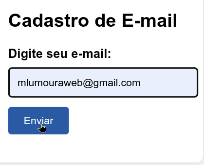
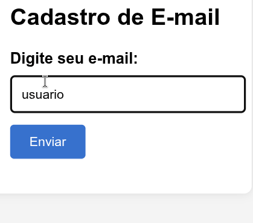

Perfeito, Lu! Aqui está a versão atualizada do seu `README.md`, agora com a **RegEx avançada explicada**, os **badges**, e a seção de **GIF demonstrativo** prontinha pra receber a estrela do show. Tudo com carinho e estilo 💅

---

# 📧 Validação de E-mail com JavaScript

> Projeto desenvolvido por [@mlumoura](https://github.com/mlumoura)  
> Repositório: [validacao_email](https://github.com/mlumoura/validacao_email)


---

## 🎬 Demonstração

**✅ Validação bem-sucedida:**



**❌ Validação com erro:**



> O campo de e-mail muda de cor conforme a validade do texto digitado.  
> Em breve: animação mostrando a validação em tempo real!

📸 *GIF demonstrativo em breve!*  
*(Você pode gravar com [Screenity](https://chrome.google.com/webstore/detail/screenity-screen-recorder/) ou [LICEcap](https://www.cockos.com/licecap/) e subir como `demo.gif` no repositório)*

```markdown

```

---

## 🗂️ Estrutura de Arquivos

| Arquivo        | Função                                      | Link |
|----------------|---------------------------------------------|------|
| 📄 `index.html` | Estrutura da página                         | [Ver](https://github.com/mlumoura/validacao_email/blob/main/index.html) |
| 🎨 `style.css`  | Estilização visual                          | [Ver](https://github.com/mlumoura/validacao_email/blob/main/style.css) |
| ⚙️ `script.js`  | Lógica de validação e manipulação do DOM    | [Ver](https://github.com/mlumoura/validacao_email/blob/main/script.js) |

---

## 🧠 Tecnologias Utilizadas

- HTML5 semântico  
- CSS3 com classes reutilizáveis  
- JavaScript puro (Vanilla JS)  
- Expressões Regulares para validação  
- Manipulação do DOM com `querySelector`, `addEventListener`, etc.

---

## 🔍 Como Funciona

O script realiza:

- ✅ Validação do campo de e-mail com RegEx avançada  
- 🔄 Feedback visual em tempo real (borda vermelha ou verde)  
- ⛔ Bloqueio do envio do formulário com `preventDefault()`  
- 🕒 Simulação de verificação com backend usando `setTimeout`

---

## 🧪 A RegEx Desmistificada

```js
const regex = /^[^\s@]+@[^\s@]+\.[^\s@\.]+(\.[^\s@\.]+)*$/;
```

### 🔍 Quebra por partes:

| Trecho                    | O que faz                                                                 |
|---------------------------|---------------------------------------------------------------------------|
| `^`                       | Início da string                                                          |
| `[^\s@]+`                 | Um ou mais caracteres que **não** sejam espaço (`\s`) ou arroba (`@`)     |
| `@`                       | Arroba obrigatória                                                        |
| `[^\s@]+`                 | Parte do domínio antes do primeiro ponto                                  |
| `\.`                      | Ponto literal (precisa escapar com `\`)                                   |
| `[^\s@\.]+`               | Parte do domínio após o ponto (ex: `com`, `br`, etc.)                     |
| `(\.[^\s@\.]+)*`          | Zero ou mais grupos adicionais com ponto + texto (ex: `.com.br`)         |
| `$`                       | Fim da string                                                             |

💡 **Resumo:** Permite e-mails como `lu@copilot.dev.br`, `contato@sub.dominio.com.br`, e bloqueia formatos inválidos como `lu@`, `lu@email..com`, `lu@.com`.

---

## 📦 Trecho do Código Real

```js
document.addEventListener("DOMContentLoaded", () => {
  const emailInput = document.getElementById("email");
  const form = document.getElementById("formulario");

  form.addEventListener("submit", (e) => {
    e.preventDefault();
    const email = emailInput.value;
    const regex = /^[^\s@]+@[^\s@]+\.[^\s@\.]+(\.[^\s@\.]+)*$/;

    if (regex.test(email)) {
      emailInput.style.border = "2px solid green";
    } else {
      emailInput.style.border = "2px solid red";
    }
  });
});
```

---

## 🚀 Melhorias Futuras

- 🔗 Integração com API real  
- 🧩 Validação por etapas (multi-step)  
- 🧠 Feedback com ícones e animações  
- ♿ Acessibilidade com ARIA  
- 💾 Armazenamento local com `localStorage`

---

## ❓ FAQ Técnico

**🟡 Posso usar `type="email"` no input?**  
Sim, mas usamos `type="text"` para controle total com JavaScript.

**🟢 Por que usar `DOMContentLoaded`?**  
Evita que o script tente acessar elementos que ainda não foram carregados.

**🔴 O que acontece se eu não usar `preventDefault()`?**  
O formulário será enviado e a página recarregada, interrompendo a validação.

---

## 👩‍💻 Autoria

Feito com carinho por [@mlumoura](https://github.com/mlumoura)  
Se curtir, ⭐ o repositório e compartilhe!

---

Agora que o README está tinindo, vamos partir pro GIF! Me conta: você quer que ele mostre só a validação do campo ou também a simulação de envio com loading? Posso te ajudar a montar o roteiro visual e até sugerir estilos pra deixar com cara de app profissional. Vamos nessa! 💙

